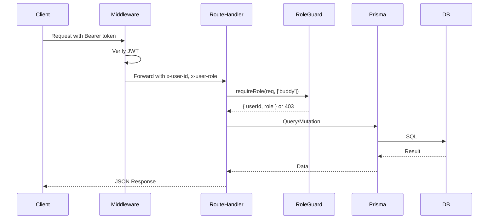
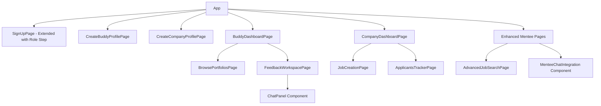

# Design Document: Multi-Role Ecosystem

## Overview

The Multi-Role Ecosystem extends PortfolioTutTat from a mentee-only platform into a full multi-role system supporting four distinct roles: **Mentee**, **Buddy** (portfolio reviewer), **Company** (employer), and **Admin**. This design introduces role-specific profiles, a buddy feedback workspace with direct messaging, company job management with applicant tracking, and role-based API access control.

### Key Design Decisions

1. **Separate Profile Models per Role** — BuddyProfile and CompanyProfile are 1-1 with User (mirroring existing Profile for Mentee). This avoids a monolithic profile table and allows role-specific fields without nullable sprawl.
2. **Portfolio-Contextual Messaging** — Messages are scoped to a portfolio context (feedbackRequest), not general-purpose chat. This keeps the messaging model simple and focused.
3. **Role Guard Utility Pattern** — A reusable `requireRole(req, allowedRoles)` guard extracts and validates roles from middleware-forwarded headers, returning 403 on mismatch.
4. **Existing Registration Transaction Extended** — The register route conditionally creates the appropriate profile type (or skips for admin) within the same transaction.
5. **Job Model Extended In-Place** — New fields added to the existing Job model with optional types to maintain backward compatibility with existing data.

### Architecture Diagram

```mermaid
graph TB
    subgraph Frontend [React SPA - Vite]
        SignUp[SignUpPage - Role Selection]
        BuddyPages[Buddy Pages]
        CompanyPages[Company Pages]
        MenteePages[Mentee Pages - Enhanced]
    end

    subgraph Middleware [Next.js Middleware]
        MW[middleware.ts - JWT verify, forward x-user-id, x-user-role]
    end

    subgraph API [Next.js App Router API]
        AuthRoutes[/api/auth/*]
        BuddyRoutes[/api/buddy/*]
        CompanyRoutes[/api/company/*]
        MessageRoutes[/api/messages/*]
        JobRoutes[/api/jobs/* - Extended]
    end

    subgraph Guards [Role Guards]
        RoleGuard[requireRole utility]
    end

    subgraph Database [PostgreSQL via Prisma]
        User
        BuddyProfile
        CompanyProfile
        Profile[Profile - Mentee]
        Message
        PortfolioBookmark
        Job[Job - Extended]
        Project[Project + isApproved]
    end

    Frontend --> MW --> API
    API --> Guards --> Database
```

---

## Architecture

### High-Level Architecture

The system follows the existing Next.js App Router pattern with layered concerns:

1. **Transport Layer** — Next.js middleware intercepts all `/api/*` requests, verifies JWT, forwards `x-user-id` and `x-user-role` headers.
2. **Authorization Layer** — Role guard utility (`lib/role-guard.ts`) validates that the authenticated user's role matches the endpoint's allowed roles.
3. **Business Logic Layer** — Route handlers in `app/api/` implement feature logic using Prisma ORM.
4. **Data Layer** — PostgreSQL with Prisma schema defining all models and relations.
5. **Frontend Layer** — React SPA with role-aware routing and conditional UI rendering.

### Request Flow



### Subsystem Decomposition

| Subsystem | Responsibility | Endpoints |
|-----------|---------------|-----------|
| Auth | Multi-role registration, role validation | `/api/auth/register` |
| Buddy | Profile CRUD, dashboard stats, portfolio browsing, workspace | `/api/buddy/**` |
| Company | Profile CRUD, dashboard stats, job creation, applicant tracking | `/api/company/**` |
| Messaging | Portfolio-scoped direct messages between buddy and mentee | `/api/messages/**` |
| Job Search | Extended filtering with categories, employment type, seniority | `/api/jobs/**` |

---

## Components and Interfaces

### Backend Components

#### 1. Role Guard (`lib/role-guard.ts`)

```typescript
interface AuthUser {
  userId: string;
  role: string;
}

function requireRole(
  req: NextRequest,
  allowedRoles: string[]
): AuthUser | NextResponse;
```

Returns the authenticated user if their role is in `allowedRoles` (or is `admin`), otherwise returns a 403 error response.

#### 2. BuddyProfile Service (`app/api/buddy/`)

| Endpoint | Method | Description |
|----------|--------|-------------|
| `/api/buddy/profile` | POST | Create BuddyProfile |
| `/api/buddy/profile/me` | GET | Get own BuddyProfile |
| `/api/buddy/profile/me` | PUT | Update BuddyProfile |
| `/api/buddy/dashboard/stats` | GET | Dashboard statistics |
| `/api/buddy/portfolios/browse` | GET | Browse pending portfolios (skill-matched) |
| `/api/buddy/portfolios/bookmark` | POST | Bookmark a portfolio |
| `/api/buddy/portfolios/bookmark/:projectId` | DELETE | Remove bookmark |
| `/api/buddy/workspace` | GET | List bookmarked portfolios |
| `/api/buddy/workspace/:feedbackRequestId/start` | PATCH | Start review |
| `/api/buddy/workspace/:feedbackRequestId/complete` | PATCH | Complete review |

#### 3. CompanyProfile Service (`app/api/company/`)

| Endpoint | Method | Description |
|----------|--------|-------------|
| `/api/company/profile` | POST | Create CompanyProfile |
| `/api/company/profile/me` | GET | Get own CompanyProfile |
| `/api/company/profile/me` | PUT | Update CompanyProfile |
| `/api/company/dashboard/stats` | GET | Dashboard statistics |
| `/api/company/jobs` | GET/POST | List/Create jobs |
| `/api/company/jobs/:id` | PUT/DELETE | Update/Delete job |
| `/api/company/jobs/:id/applicants` | GET | List applicants for job |
| `/api/company/applications/:id/status` | PATCH | Update application status |

#### 4. Messaging Service (`app/api/messages/`)

| Endpoint | Method | Description |
|----------|--------|-------------|
| `/api/messages` | POST | Send message |
| `/api/messages/:portfolioContextId` | GET | Get chat history |
| `/api/messages/conversations` | GET | List active conversations |

#### 5. Extended Job Search (`app/api/jobs/`)

Extended query parameters: `keyword`, `category`, `employmentType`, `seniorityLevel`, `salaryMin`, `salaryMax`, `location`, `isRemote`, `page`, `limit`.

New endpoint: `GET /api/jobs/categories` — returns distinct categories from active jobs.

### Frontend Components

#### Page Hierarchy



#### Key Component Interfaces

```typescript
// Role selection step in SignUpPage
interface RoleSelectionProps {
  selectedRole: UserRole | null;
  onRoleSelect: (role: UserRole) => void;
}

// BuddyProfile form
interface BuddyProfileFormData {
  fullName: string;
  roleTitle: string;
  bio?: string;
  avatarUrl?: string;
  major?: Major;
  skills: string[];
  designTools: string[];
  interests: string[];
  socialLinks: {
    behance?: string;
    linkedin?: string;
    instagram?: string;
    github?: string;
  };
}

// CompanyProfile form
interface CompanyProfileFormData {
  companyName: string;
  summary?: string;
  productsServices?: string;
  websiteUrl?: string;
  hrContactEmail?: string;
  hrContactPhone?: string;
  teamMembers: Array<{ name: string; role: string; avatarUrl?: string }>;
  employeeCount?: string;
  officeAddress?: string;
  referenceLinks: Array<{ url: string; label: string }>;
}

// Message component
interface ChatMessage {
  id: string;
  senderId: string;
  receiverId: string;
  content: string;
  createdAt: string;
  isMine: boolean;
}

// Job creation form (extended)
interface JobCreateFormData {
  title: string;
  description: string;
  openSlots: number;
  location?: string;
  employmentType?: EmploymentType;
  seniorityLevel?: SeniorityLevel;
  minExperienceYears?: number;
  requiredSkills: string[];
  salaryMin?: number;
  salaryMax?: number;
  salaryPeriod?: 'monthly' | 'yearly';
  requiresManagement: boolean;
  minManagedEmployees?: number;
  category?: string;
}
```

#### Routing Extensions

```typescript
// New protected routes
<Route path="create-buddy-profile" element={<CreateBuddyProfilePage />} />
<Route path="create-company-profile" element={<CreateCompanyProfilePage />} />
<Route path="buddy-dashboard" element={<BuddyDashboardPage />} />
<Route path="browse-portfolios" element={<BrowsePortfoliosPage />} />
<Route path="feedback-workspace" element={<FeedbackWorkspacePage />} />
<Route path="job-creation" element={<JobCreationPage />} />
<Route path="applicants-tracker" element={<ApplicantsTrackerPage />} />
<Route path="advanced-job-search" element={<AdvancedJobSearchPage />} />
```

---

## Data Models

### New Prisma Schema Additions

#### Enums

```prisma
enum EmploymentType {
  full_time
  part_time
  internship
  contract
  freelance
  temporary
  volunteer
}

enum SeniorityLevel {
  internship
  entry
  assistant
  mid_senior
  director
  executive
}
```

#### BuddyProfile Model

```prisma
model BuddyProfile {
  id            String   @id @default(uuid()) @db.Uuid
  userId        String   @unique @map("user_id") @db.Uuid
  fullName      String   @map("full_name") @db.VarChar(255)
  roleTitle     String   @map("role_title") @db.VarChar(255)
  bio           String?  @db.Text
  avatarUrl     String?  @map("avatar_url") @db.VarChar(500)
  major         Major?
  skills        String[]
  designTools   String[] @map("design_tools")
  interests     String[]
  socialLinks   Json     @default("{}") @map("social_links")
  completionPct Int      @default(0) @map("completion_pct") @db.SmallInt
  createdAt     DateTime @default(now()) @map("created_at") @db.Timestamptz
  updatedAt     DateTime @updatedAt @map("updated_at") @db.Timestamptz

  user               User               @relation(fields: [userId], references: [id], onDelete: Cascade)
  portfolioBookmarks PortfolioBookmark[]

  @@map("buddy_profiles")
}
```

#### CompanyProfile Model

```prisma
model CompanyProfile {
  id              String   @id @default(uuid()) @db.Uuid
  userId          String   @unique @map("user_id") @db.Uuid
  companyName     String   @map("company_name") @db.VarChar(255)
  summary         String?  @db.Text
  productsServices String? @map("products_services") @db.Text
  websiteUrl      String?  @map("website_url") @db.VarChar(500)
  hrContactEmail  String?  @map("hr_contact_email") @db.VarChar(255)
  hrContactPhone  String?  @map("hr_contact_phone") @db.VarChar(50)
  employeeCount   String?  @map("employee_count") @db.VarChar(50)
  officeAddress   String?  @map("office_address") @db.Text
  referenceLinks  Json     @default("[]") @map("reference_links")
  teamMembers     Json     @default("[]") @map("team_members")
  createdAt       DateTime @default(now()) @map("created_at") @db.Timestamptz
  updatedAt       DateTime @updatedAt @map("updated_at") @db.Timestamptz

  user User @relation(fields: [userId], references: [id], onDelete: Cascade)

  @@map("company_profiles")
}
```

#### Message Model

```prisma
model Message {
  id                 String   @id @default(uuid()) @db.Uuid
  senderId           String   @map("sender_id") @db.Uuid
  receiverId         String   @map("receiver_id") @db.Uuid
  content            String   @db.Text
  portfolioContextId String?  @map("portfolio_context_id") @db.Uuid
  createdAt          DateTime @default(now()) @map("created_at") @db.Timestamptz

  sender   User     @relation("MessagesSent", fields: [senderId], references: [id])
  receiver User     @relation("MessagesReceived", fields: [receiverId], references: [id])
  project  Project? @relation(fields: [portfolioContextId], references: [id], onDelete: SetNull)

  @@index([senderId, receiverId])
  @@index([portfolioContextId])
  @@map("messages")
}
```

#### PortfolioBookmark Model

```prisma
model PortfolioBookmark {
  id        String   @id @default(uuid()) @db.Uuid
  buddyId   String   @map("buddy_id") @db.Uuid
  projectId String   @map("project_id") @db.Uuid
  createdAt DateTime @default(now()) @map("created_at") @db.Timestamptz

  buddy   BuddyProfile @relation(fields: [buddyId], references: [id], onDelete: Cascade)
  project Project      @relation(fields: [projectId], references: [id], onDelete: Cascade)

  @@unique([buddyId, projectId])
  @@map("portfolio_bookmarks")
}
```

#### Job Model Extensions

```prisma
// Additional fields on existing Job model:
openSlots           Int?            @map("open_slots")
employmentType      EmploymentType? @map("employment_type")
seniorityLevel      SeniorityLevel? @map("seniority_level")
minExperienceYears  Int?            @map("min_experience_years")
requiresManagement  Boolean         @default(false) @map("requires_management")
minManagedEmployees Int?            @map("min_managed_employees")
salaryPeriod        String?         @map("salary_period") @db.VarChar(20)
category            String?         @db.VarChar(100)
```

#### Project Model Extension

```prisma
// Additional field on existing Project model:
isApproved Boolean @default(false) @map("is_approved")
```

### Zod Validation Schemas

```typescript
// lib/validations/buddy-profile.ts
const buddyProfileCreateSchema = z.object({
  fullName: z.string().min(1).max(255).refine(s => s.trim().length > 0),
  roleTitle: z.string().min(1).max(255).refine(s => s.trim().length > 0),
  bio: z.string().max(2000).optional(),
  avatarUrl: z.string().max(500).optional(),
  major: z.nativeEnum(Major).optional(),
  skills: z.array(z.string().max(100)).max(20).default([]),
  designTools: z.array(z.string().max(100)).max(20).default([]),
  interests: z.array(z.string().max(100)).max(20).default([]),
  socialLinks: z.object({
    behance: z.string().max(500).refine(s => !s || s.startsWith('https://')).optional(),
    linkedin: z.string().max(500).refine(s => !s || s.startsWith('https://')).optional(),
    instagram: z.string().max(500).refine(s => !s || s.startsWith('https://')).optional(),
    github: z.string().max(500).refine(s => !s || s.startsWith('https://')).optional(),
  }).default({}),
});

// lib/validations/company-profile.ts
const companyProfileCreateSchema = z.object({
  companyName: z.string().min(1).max(255).refine(s => s.trim().length > 0),
  summary: z.string().max(5000).optional(),
  productsServices: z.string().max(5000).optional(),
  websiteUrl: z.string().max(500).refine(s => !s || s.startsWith('https://')).optional(),
  hrContactEmail: z.string().email().max(255).optional(),
  hrContactPhone: z.string().max(50).optional(),
  teamMembers: z.array(z.object({
    name: z.string().min(1).max(255),
    role: z.string().min(1).max(255),
    avatarUrl: z.string().max(500).optional(),
  })).default([]),
  employeeCount: z.string().max(50).optional(),
  officeAddress: z.string().max(500).optional(),
  referenceLinks: z.array(z.object({
    url: z.string().url().max(500),
    label: z.string().max(255),
  })).default([]),
});

// lib/validations/job-create.ts
const jobCreateSchema = z.object({
  title: z.string().min(1).max(255),
  description: z.string().min(1).max(5000),
  openSlots: z.number().int().min(1).max(1000),
  location: z.string().max(500).optional(),
  employmentType: z.nativeEnum(EmploymentType).optional(),
  seniorityLevel: z.nativeEnum(SeniorityLevel).optional(),
  minExperienceYears: z.number().int().min(0).max(50).optional(),
  requiredSkills: z.array(z.string().max(100)).max(20).default([]),
  salaryMin: z.number().min(0).max(999999999).optional(),
  salaryMax: z.number().min(0).max(999999999).optional(),
  salaryPeriod: z.enum(['monthly', 'yearly']).optional(),
  requiresManagement: z.boolean().default(false),
  minManagedEmployees: z.number().int().min(1).max(10000).optional(),
  category: z.string().max(100).optional(),
}).refine(
  data => !(data.salaryMin && data.salaryMax && data.salaryMin > data.salaryMax),
  { message: 'salaryMin cannot exceed salaryMax', path: ['salaryMin'] }
);

// lib/validations/message.ts
const messageCreateSchema = z.object({
  receiverId: z.string().uuid(),
  content: z.string().min(1).max(2000).refine(s => s.trim().length > 0),
  portfolioContextId: z.string().uuid(),
});

// lib/validations/application-status.ts
const applicationStatusUpdateSchema = z.object({
  status: z.enum(['under_review', 'accepted', 'rejected']),
});
```

### CompletionPct Calculation Logic

```typescript
function calculateBuddyCompletionPct(data: BuddyProfileData): number {
  const fields = [
    data.fullName?.trim().length > 0,
    data.roleTitle?.trim().length > 0,
    data.bio?.trim().length > 0,
    data.avatarUrl?.trim().length > 0,
    data.major != null,
    data.skills?.length > 0,
    data.designTools?.length > 0,
    data.interests?.length > 0,
    hasSocialLink(data.socialLinks),
  ];
  return Math.floor((fields.filter(Boolean).length / 9) * 100);
}
```

### Application Status Transition Logic

```typescript
const VALID_TRANSITIONS: Record<string, string[]> = {
  submitted: ['under_review'],
  under_review: ['accepted', 'rejected'],
  accepted: [],
  rejected: [],
};

function isValidTransition(currentStatus: string, newStatus: string): boolean {
  return VALID_TRANSITIONS[currentStatus]?.includes(newStatus) ?? false;
}
```

### Skill-Match Sorting Algorithm

For Browse Portfolios, projects are sorted by skill overlap:

```typescript
function calculateSkillMatchScore(
  projectTags: string[],
  buddySkills: string[],
  buddyDesignTools: string[]
): number {
  const buddySet = new Set([
    ...buddySkills.map(s => s.toLowerCase()),
    ...buddyDesignTools.map(s => s.toLowerCase()),
  ]);
  return projectTags.filter(tag => buddySet.has(tag.toLowerCase())).length;
}
```


---

## Correctness Properties

*A property is a characteristic or behavior that should hold true across all valid executions of a system — essentially, a formal statement about what the system should do. Properties serve as the bridge between human-readable specifications and machine-verifiable correctness guarantees.*

### Property 1: Registration Role Assignment Round-Trip

*For any* valid registration payload with a role value in {mentee, buddy, company, admin}, after successful registration, the created User record's `role` field SHALL equal the submitted role value exactly.

**Validates: Requirements 1.2, 1.3, 1.4, 1.5, 1.7**

### Property 2: Invalid Role Rejection at Registration

*For any* string value that is not a member of the set {mentee, buddy, company, admin}, the registration endpoint SHALL reject the request with a validation error and SHALL NOT create a User record.

**Validates: Requirements 1.8**

### Property 3: BuddyProfile CompletionPct Calculation

*For any* BuddyProfile data (with arbitrary combinations of filled and unfilled fields), the `completionPct` value SHALL equal `Math.floor((filledFieldCount / 9) * 100)` where a field is "filled" when: string fields have at least 1 non-whitespace character, array fields have at least 1 element, enum fields have a selected value, and socialLinks has at least 1 valid URL.

**Validates: Requirements 2.4, 2.6**

### Property 4: BuddyProfile Whitespace Name Rejection

*For any* string composed entirely of whitespace characters (spaces, tabs, newlines), when used as `fullName` or `roleTitle` in BuddyProfile creation or update, the system SHALL reject the input with a validation error and SHALL NOT persist the data.

**Validates: Requirements 2.3**

### Property 5: URL Format Validation (https:// prefix)

*For any* non-empty string that does not start with "https://", when used as a Social Link URL (BuddyProfile) or Website URL (CompanyProfile), the system SHALL reject the input with a validation error.

**Validates: Requirements 2.7, 3.8**

### Property 6: BuddyProfile Data Round-Trip

*For any* valid BuddyProfile creation payload, after successful creation via POST, a subsequent GET of that profile SHALL return data where fullName, roleTitle, bio, avatarUrl, major, skills, designTools, interests, and socialLinks match the originally submitted values.

**Validates: Requirements 2.2, 2.5**

### Property 7: Field Length Limit Enforcement

*For any* string exceeding the maximum character limit for its field (fullName > 255, roleTitle > 255, bio > 2000, URL > 500, skill item > 100) or arrays exceeding 20 items, the BuddyProfile validation SHALL reject the input.

**Validates: Requirements 2.9**

### Property 8: CompanyProfile Data Round-Trip

*For any* valid CompanyProfile creation payload (with companyName having at least 1 non-whitespace character), after successful creation, a subsequent GET SHALL return data matching the originally submitted values for all fields including teamMembers and referenceLinks.

**Validates: Requirements 3.2, 3.5, 3.6**

### Property 9: Buddy Dashboard Stats Correctness

*For any* buddy with a set of assigned FeedbackRequests, Feedbacks, and Messages, the dashboard stats endpoint SHALL return: `completedReviews` equal to the count of FeedbackRequests with status=completed assigned to this buddy, `pendingReviews` equal to count with status=pending, `activeMessages` equal to the count of distinct conversations with messages in the last 7 days, and `helpfulRating` equal to `round(totalHelpfulVotes / totalFeedbacks, 1)` (or 0.0 when totalFeedbacks is 0).

**Validates: Requirements 4.1, 4.2, 4.3**

### Property 10: Dashboard Recent Items Limit and Sort

*For any* buddy with n assigned FeedbackRequests, the dashboard SHALL return at most 5 items sorted by assigned date descending.

**Validates: Requirements 4.5**

### Property 11: Browse Portfolios Skill-Match Sort Order

*For any* set of projects with status=pending_feedback and a buddy's skills/designTools, the browse endpoint SHALL return results sorted in descending order by the count of matching tags between the project's tags and the buddy's combined skills+designTools set, with ties broken by date descending.

**Validates: Requirements 5.1, 5.2**

### Property 12: Portfolio Bookmark Uniqueness (Idempotence)

*For any* valid (buddyId, projectId) pair, bookmarking SHALL succeed on first attempt and create exactly one record; subsequent bookmark attempts for the same pair SHALL be rejected with an error, and the total bookmark count SHALL remain unchanged.

**Validates: Requirements 5.3, 5.4**

### Property 13: Portfolio Filter AND Logic

*For any* combination of active filters (tags, major), every project in the filtered results SHALL satisfy ALL active filter criteria simultaneously. A project with tags not intersecting the filter tags SHALL NOT appear in results.

**Validates: Requirements 5.5**

### Property 14: Message Content Validation Boundaries

*For any* message content string, the messaging endpoint SHALL: accept strings with 1 to 2000 characters (after trimming) that contain at least 1 non-whitespace character; reject strings that are empty, whitespace-only, or exceed 2000 characters.

**Validates: Requirements 6.4, 6.6, 6.9, 10.2, 10.5**

### Property 15: Message History Retrieval Order and Limit

*For any* conversation with n messages, the GET messages endpoint SHALL return at most 50 messages sorted by `createdAt` ascending (oldest first).

**Validates: Requirements 6.7, 10.4**

### Property 16: FeedbackRequest State Transition — Start Review

*For any* FeedbackRequest with status=pending, executing the start-review action SHALL transition the status to in_review. For any FeedbackRequest NOT in status=pending, the start-review action SHALL be rejected.

**Validates: Requirements 6.2**

### Property 17: FeedbackRequest State Transition — Complete Review

*For any* FeedbackRequest with status=in_review, executing the complete-review action SHALL transition the status to completed AND set the associated project's `isApproved` field to true. For any FeedbackRequest NOT in status=in_review, the complete action SHALL be rejected with an error.

**Validates: Requirements 6.5, 6.8, 13.1**

### Property 18: Company Dashboard Stats Correctness

*For any* company with a set of jobs and applications, the dashboard stats endpoint SHALL return: `activeJobs` equal to count of jobs with isActive=true, `totalApplications` equal to count of all applications across all company jobs, `newApplicantsThisWeek` equal to count of applications with createdAt within the last 7 days; and the recent jobs list SHALL contain at most 5 jobs sorted by createdAt desc, each with its correct application count.

**Validates: Requirements 7.1, 7.2, 7.4**

### Property 19: Job Creation Validation — Salary Range Consistency

*For any* job creation payload where both salaryMin and salaryMax are provided and salaryMin > salaryMax, the system SHALL reject the creation with a validation error. When only one of salaryMin or salaryMax is provided, the creation SHALL succeed.

**Validates: Requirements 8.7, 8.9**

### Property 20: Job Creation — Valid Data Creates Active Job

*For any* valid job creation payload (title 1-255 chars, description 1-5000 chars, openSlots integer 1-1000), the system SHALL create a job record with isActive=true.

**Validates: Requirements 8.5**

### Property 21: Job Creation — openSlots Validation

*For any* value for openSlots that is not a positive integer between 1 and 1000 (including decimals, negative numbers, zero, or non-numeric values), the system SHALL reject the job creation with a validation error.

**Validates: Requirements 8.10**

### Property 22: Application Status State Machine

*For any* application with a current status, the system SHALL only allow transitions defined by the valid transition map: submitted → under_review, under_review → accepted, under_review → rejected. Any other transition (e.g., submitted → accepted, rejected → under_review, accepted → anything) SHALL be rejected with an error describing the current status and valid next states.

**Validates: Requirements 9.5, 9.6**

### Property 23: Job Search Filter Intersection (AND Logic)

*For any* combination of active search filters (keyword, category, employmentType, seniorityLevel, salaryRange, location, isRemote), every job in the results SHALL satisfy ALL active filter predicates simultaneously.

**Validates: Requirements 11.2, 11.3, 11.5**

### Property 24: Role-Based API Access Control

*For any* request to a role-restricted endpoint (`/api/buddy/**` requires buddy|admin, `/api/company/**` requires company|admin), if the authenticated user's role is not in the allowed set, the system SHALL return HTTP 403 with response body `{ success: false, error: { message, code: 'FORBIDDEN' } }`. If the role is "admin", access SHALL always be granted regardless of endpoint restriction.

**Validates: Requirements 12.1, 12.2, 12.3, 12.4, 12.7**

### Property 25: Portfolio Selector Shows Only Public Portfolios

*For any* set of projects belonging to a mentee with mixed statuses (draft, public, pending_feedback), the portfolio selector in job application SHALL only display projects with status=public.

**Validates: Requirements 13.4**

---

## Error Handling

### API Error Response Format

All errors follow the existing pattern from `lib/response.ts`:

```json
{
  "success": false,
  "error": {
    "message": "Human-readable error description",
    "code": "ERROR_CODE"
  }
}
```

### Error Code Extensions

| Code | HTTP Status | Description |
|------|-------------|-------------|
| VALIDATION_ERROR | 400 | Input validation failed (Zod parse error) |
| UNAUTHORIZED | 401 | Missing or invalid JWT / x-user-role header |
| FORBIDDEN | 403 | Role doesn't match endpoint requirements |
| NOT_FOUND | 404 | Resource not found (profile, job, message, etc.) |
| CONFLICT | 409 | Duplicate resource (email, bookmark, etc.) |
| INVALID_STATE_TRANSITION | 422 | Invalid status transition (application, feedback request) |
| INTERNAL_ERROR | 500 | Unexpected server error |

### Error Scenarios by Subsystem

#### Auth Errors
- Registration with duplicate email → 409 CONFLICT
- Registration with invalid role → 400 VALIDATION_ERROR
- Admin registration without invite code → 403 FORBIDDEN

#### Buddy Errors
- Creating BuddyProfile when one exists → 409 CONFLICT (redirect to edit)
- Accessing buddy endpoints with non-buddy role → 403 FORBIDDEN
- Bookmarking non-existent project → 404 NOT_FOUND
- Duplicate bookmark → 409 CONFLICT
- Starting review on non-pending FeedbackRequest → 422 INVALID_STATE_TRANSITION
- Completing review on non-in_review FeedbackRequest → 422 INVALID_STATE_TRANSITION

#### Company Errors
- Creating CompanyProfile when one exists → 409 CONFLICT
- Accessing company endpoints with non-company role → 403 FORBIDDEN
- Creating job with salaryMin > salaryMax → 400 VALIDATION_ERROR
- Invalid application status transition → 422 INVALID_STATE_TRANSITION
- Updating application for a job not owned by company → 403 FORBIDDEN

#### Messaging Errors
- Sending empty/whitespace message → 400 VALIDATION_ERROR
- Sending message > 2000 chars → 400 VALIDATION_ERROR
- Sending message for non-in_review FeedbackRequest → 403 FORBIDDEN
- Accessing conversation user is not part of → 403 FORBIDDEN

#### Job Search Errors
- Invalid filter parameters → 400 VALIDATION_ERROR (graceful — return empty results with message)

### Resilience Patterns

1. **Notification failures don't block state transitions** — If sending a notification fails after a status update (e.g., application status change, review start/complete), the state change is committed and the notification is logged for retry.
2. **isApproved update failure after review completion** — FeedbackRequest stays completed; failure is logged for retry. Portfolio's isApproved is eventually consistent.
3. **Database transaction for profile creation** — Registration creates User + profile (BuddyProfile/CompanyProfile/Profile) in a single transaction; failure rolls back both.

---

## Testing Strategy

### Testing Framework

- **Unit & Property Tests**: Vitest + fast-check (already installed)
- **Test Location**: `tests/` directory at project root
- **Run Command**: `vitest run`

### Dual Testing Approach

#### Property-Based Tests (fast-check)

Property-based testing is appropriate for this feature because:
- Multiple pure validation functions (Zod schemas, completionPct calculation, state transitions, skill matching)
- Clear input/output behavior with wide input spaces
- Universal properties that must hold across all inputs

**Configuration:**
- Minimum 100 iterations per property test
- Each test tagged with property reference: `// Feature: multi-role-ecosystem, Property N: description`

**Test Files:**
- `tests/properties/buddy-profile.property.test.ts` — Properties 3, 4, 5, 6, 7
- `tests/properties/company-profile.property.test.ts` — Properties 5, 8
- `tests/properties/messaging.property.test.ts` — Properties 14, 15
- `tests/properties/role-guard.property.test.ts` — Properties 24
- `tests/properties/registration.property.test.ts` — Properties 1, 2
- `tests/properties/job-creation.property.test.ts` — Properties 19, 20, 21
- `tests/properties/application-status.property.test.ts` — Property 22
- `tests/properties/dashboard-stats.property.test.ts` — Properties 9, 10, 18
- `tests/properties/browse-portfolios.property.test.ts` — Properties 11, 12, 13
- `tests/properties/job-search.property.test.ts` — Property 23
- `tests/properties/feedback-workflow.property.test.ts` — Properties 16, 17
- `tests/properties/portfolio-selector.property.test.ts` — Property 25

#### Example-Based Unit Tests

Focus on specific scenarios, integration points, and edge cases:

- `tests/unit/auth-register.test.ts` — Admin invite code flow, duplicate email, redirect logic
- `tests/unit/buddy-profile-crud.test.ts` — Create/read/update lifecycle, redirect when exists
- `tests/unit/company-profile-crud.test.ts` — Create/read/update lifecycle, tab sections
- `tests/unit/buddy-workspace.test.ts` — Start/complete review lifecycle, notification creation
- `tests/unit/applicants-tracker.test.ts` — View applicants, status update lifecycle
- `tests/unit/messaging.test.ts` — Send/receive flow, conversation listing
- `tests/unit/job-search.test.ts` — Category tags, advanced filter UI, clear filters

#### Integration Tests

For testing database interactions and multi-service coordination:

- `tests/integration/registration-flow.test.ts` — Full registration with profile creation transaction
- `tests/integration/review-workflow.test.ts` — Bookmark → start review → message → complete → approval
- `tests/integration/notification-resilience.test.ts` — Notification failure doesn't block state change

### Test Priorities

1. **Critical Path (Property Tests)**: Role guard (P24), state machines (P16, P17, P22), validation (P14, P19)
2. **Core Logic (Property Tests)**: CompletionPct (P3), skill matching (P11), filter intersection (P13, P23)
3. **Data Integrity (Property + Unit Tests)**: Round-trips (P6, P8), uniqueness (P12)
4. **Dashboard Correctness (Property Tests)**: Stats calculations (P9, P18)
5. **Edge Cases (Unit Tests)**: Empty states, error responses, redirect behavior

### Mocking Strategy

- **Database**: Use Prisma's mock client or in-memory SQLite for unit tests
- **Notifications**: Mock notification service to test resilience patterns
- **JWT/Auth**: Mock middleware headers (x-user-id, x-user-role) directly in test requests
